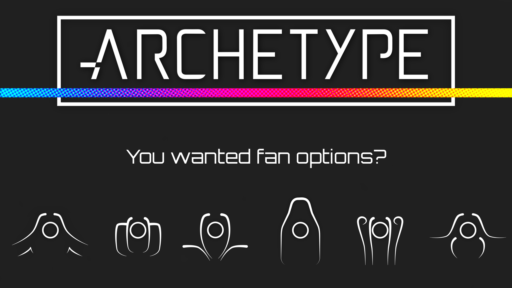

## Embrace the Unpolished Chaos: Enter the Beta Experience!

You're on the cusp of something special – a journey into the heart of innovation where rough edges and uncharted pathways converge.

Why the Beta Phase? We're not seeking the faint praise of the masses. We want the daring minds, the ones unafraid to venture into the unknown and share their unvarnished thoughts. Your feedback will be the chisel that refines our creation into a work of art.

Documentation? We're shedding the shackles of traditional handholding. No dense manuals here! Instead, we'll learn together through experimentation and intuition. It's a bit like learning to dance in the rain – unpredictable, but oh-so-liberating.

Anticipating a hint of meh-ness? Let's be real – diamonds are born from pressure, and our journey is no different. There might be a hiccup or two, but it's all part of the charm. We're crafting an experience that's as authentic as it gets.

So, are you up for the challenge? Ready to be part of a story that celebrates imperfections and turns them into strengths? Embrace the thrill of being part of the Beta Experience. Your adventure starts now!

And yes... Maz did get ChatGPT to write this in order to let Leddhedd get a little sleep for a couple of days!

## Whats next?

During the course of the beta we will continue to work on the supporting documentation, build guides and the configuator.

## Where is the CAD?

The CAD is undergoing some housekeeping before both .STEP and .F3D files will be made avaliable shortly.

## Incase you missed it **Check out the Beta Release VOD below!**

